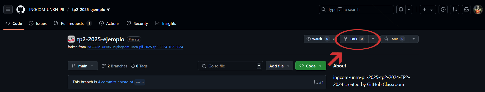
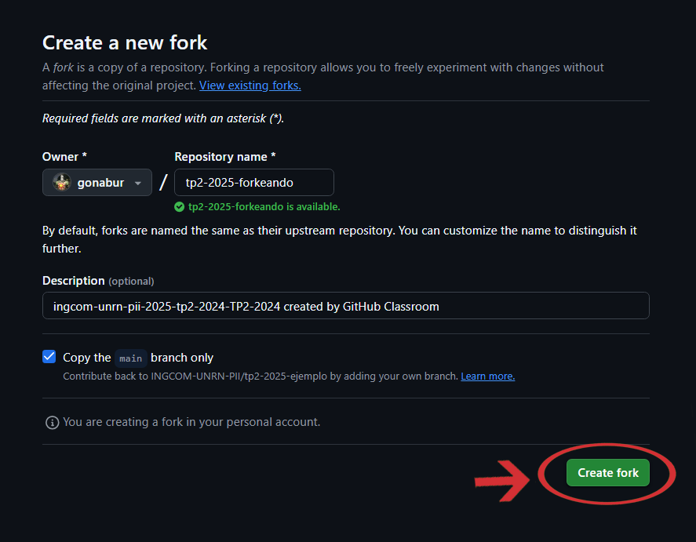
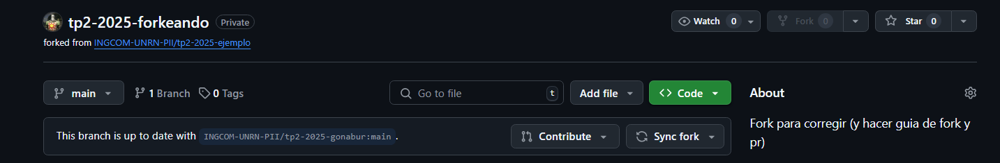
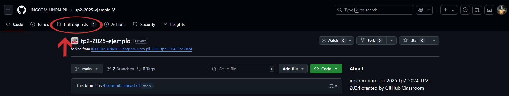
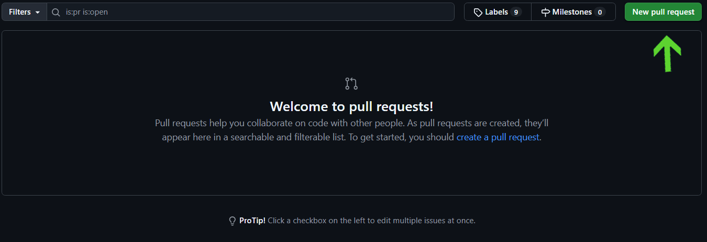
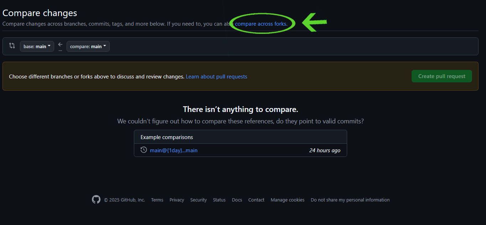
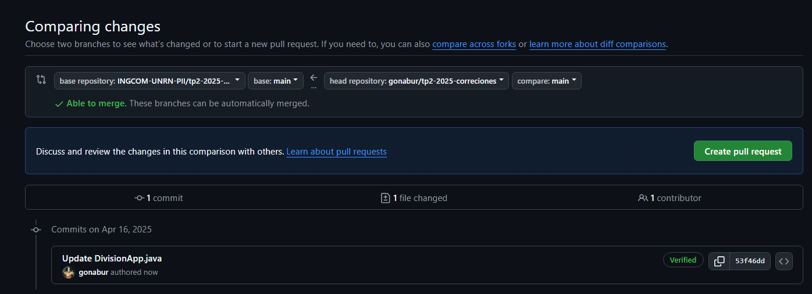
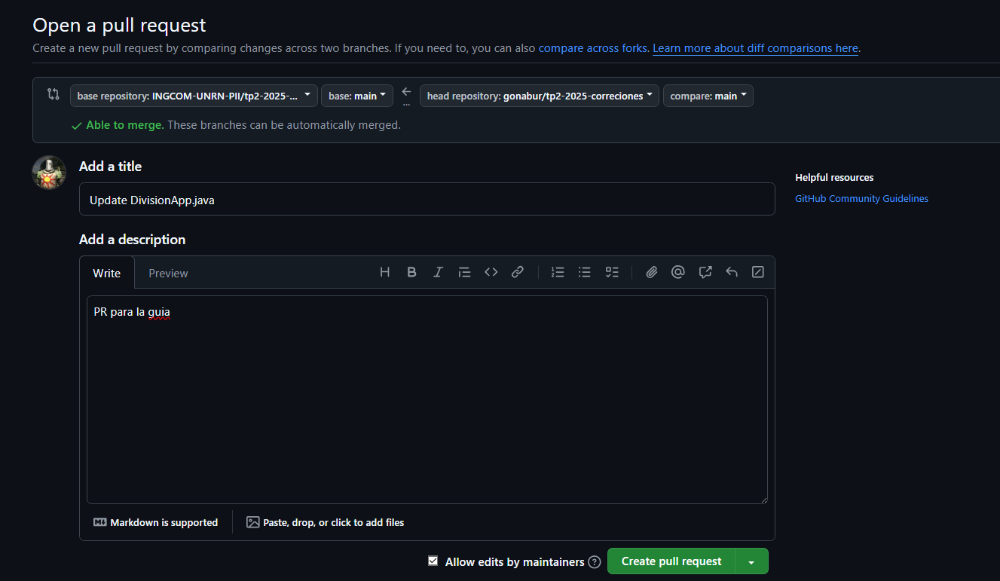

# Guía para hacer un _Fork_ y _Pull-Request_
Esta pequeña guía está centrada en enseñar a utilizar el _fork_ y crear _pull-requests_ para la entrega de Trabajos Prácticos fuera de término.

Primero vamos a ver qué es cada uno y luego el cómo se hacen.

# Definiciones
## Fork
En GitHub, un fork es una manera de hacer una copia de un repositorio en la cuenta del usuario. 
Esto es útil para cuando queramos entregar trabajos fuera del plazo de entrega.

## Pull-Request
Los Pull-request son solicitudes de cambio hechas por los colaboradores para solicitar cambios dentro de una rama. Estas solicitudes muestran las diferencias entre el contenido de la rama de origen y el contenido de la rama de destino.

## ¿Por qué usar esta combinación?
Luego de la fecha de entrega establecida para cada práctico, los repositorios se cierran y no se admiten nuevos
commits, por lo que podemos hacer un _fork_ del repositorio, hacer las correcciones y luego hacer un Pull-Request
para que puedan ser corregidas por el docente.

# Tutorial

## Cómo hacer un _Fork_ (desde GitHub)
Primero nos vamos a dirigir al repositorio que queramos copiar a nuestra cuenta. Una vez allí vamos a ir al botón que dice "Fork":



Esto nos redirige al apartado de creación del fork. Acá se nos explica brevemente en qué consiste y podemos cambiar el nombre, la descripción y el dueño del fork (puede ser más de uno). 



Con todo esto armado, podemos crear la copia y automáticamente GitHub nos va a llevar al nuevo repositorio.



## Trabajando en el _Fork_ 

Podemos trabajar en las copias de dos formas

### Clonando el repositorio

Con el repositorio ya creado, solamente resta clonarlo en una nueva carpeta y comenzar a trabajar en él. 
Como es una copia, los _commits_ y los _pushes_ no van a ir al repositorio original.
En todo caso, podemos verificarlo usando el comando en _Bash_
```bash
git remote -v
```
Este comando nos va a devolver la siguiente salida
```
origin  https://github.com/usuario/nombre-repositorio-forkeado.git (fetch)
origin  https://github.com/usuario/nombre-repositorio-forkeado.git (push)
```
### Reemplazando la URL del repositorio ya clonado
Otra forma de trabajar con nuestro fork es tomando la carpeta donde estábamos trabajando antes de que se cierre el repositorio y cambiarle la URL donde van nuestros cambios.

1. Para esto tenemos que abrir _Bash_ en la carpeta donde estamos trabajando.
2. Luego vamos a nuestro fork y copiamos la URL para poder trabajar en ella. 

Una vez copiado, volvemos al _Bash_ y ponemos el siguiente comando con nuestra URL:
```bash
git remote set-url origin https://github.com/usuario/nombre-repositorio-forkeado.git
```
Ahora verificamos si se cambió la dirección
```bash
git remote -v
```

Esperando el Output:
```
origin  https://github.com/usuario/nombre-repositorio-forkeado.git (fetch)
origin  https://github.com/usuario/nombre-repositorio-forkeado.git (push)
```

**Con cualquiera de los dos métodos, ya podemos empezar a subir nuestros _commits_ y _pushes_ al _fork_.**

## Haciendo un Pull-Request
Para hacer un Pull-Request tenemos que ir a la pestaña con el mismo nombre dentro de nuestro repositorio.

Acá vamos a crear un nuevo Pull-Request

Después, clickeamos en _compare across forks_

Vamos a ver que nos salen las opciones _base repository_ _base: main_ y _head repository_ _compare: main:_
- En la primera opción vamos a seleccionar el nombre del repositorio original
- En _head repository_ seleccionamos el nombre de nuestro fork
Debajo van a aparecer todos los commits que hicimos y el botón de "Create pull request"

Creamos el Pull-Request y lo subimos.


Luego de todo eso, pueden cargar el repositorio en el formulario de entrega 
(no olviden aclarar que la entrega es en un Pull request separado)

Y listo, así de sencillo es hacer un Pull-Request en GitHub.

# Créditos

@gonabur a quien armó la base de este apunte.

Se aceptan pull requests
